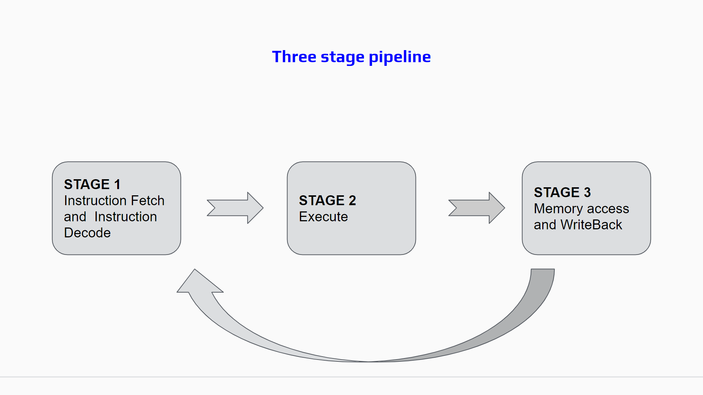
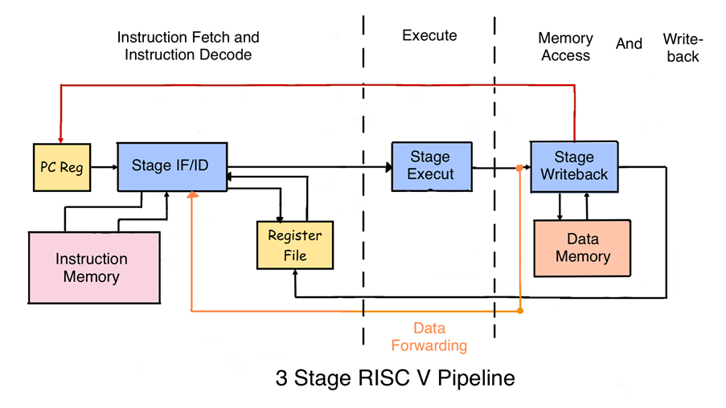
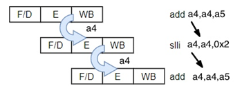
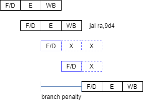
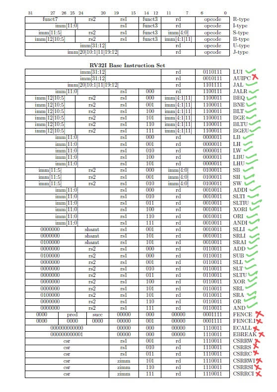

# 3-Stage RISC-V Pipeline

Implement a 3-stage RISC-V (RV32I) pipeline that runs programs against a fixed testbench. Stages: Fetch/Decode, Execute, Writeback. You must handle **data hazards** (RAW) and **control hazards** (branches/jumps) so that all tests pass. The reference design does the following; your design must achieve correct results (same or compatible behavior): **RAW** — forward the producing instruction’s result from the Writeback stage into the Execute stage when the consumer reads the same register (so the consumer gets the new value without waiting for a register-file write). **Load-use** — the load result is available when the load is in Writeback; forward that value to a dependent instruction in Execute (no extra stall cycle required). **Control** — when a branch or jump is taken in Execute, apply a **2-cycle branch penalty** (the two instructions already in the pipeline after the branch are flushed or stalled; the next fetch is from the branch target).

**Implement in `/workspace/`.** The file **`opcode.vh`** is already provided there: it defines instruction-field macros (`OPCODE`, `FUNC3`, `RD`, `RS1`, `RS2`, `SUBTYPE`) and localparams for all supported opcodes and func3 encodings (LUI, JAL, JALR, BRANCH, LOAD, STORE, ARITHI, ARITHR, branch types, load/store types, ALU ops). Use it via `include "opcode.vh"`; do not redefine these. Name your top-level file `pipeline.v` and provide a module named `pipe` (Verilog). You may add other `.v`/`.vh` files (e.g. for stages); the verifier copies all from `/workspace/` into the test environment. The testbench expects the exact interface below; internal signal names must match so the harness can connect memory and detect completion.

**Verilog only — no SystemVerilog.** The verifier compiles with plain Verilog (Icarus Verilog). Do not use SystemVerilog-only constructs.

**Provided in `/workspace/`:** `opcode.vh` — include it and use its macros/params for instruction decoding; implement `pipeline.v` and any other `.v` modules you need.

**Provided in `/reference/` (read-only):** The testbench (`tb_pipeline.v`) and memory model (`memory.v`) used during verification. You can read them to see how your `pipe` module is driven and checked: exact port list, required internal names (`pipe.inst_mem_address`, `pipe.inst_fetch_pc`, `pipe.regs`, `pipe.dmem_*`, etc.), reset/stall timing, timeout rule (PC must change within 100 cycles or FAIL), and pass/fail (on `exception`, `pipe.regs[15]` must equal the test’s expected value). The verifier compiles your design with this testbench and loads test-specific instruction and data memory (imem/dmem); the contents of those memories are not provided. Do not modify the testbench or memory module.

## Pipeline structure

The following figures show the three stages, data flow, and how data and control hazards are handled.

### Data and control hazards

**Register forwarding (data hazards):** When the data value of a register is calculated in a previous instruction and the updated value is used for the next instruction, the problem of data hazard occurs. To overcome this the updated register value is directly transfered from the writeback stage to execute stage. Include **writeback-to-execute forwarding** so that both ALU results and load results can be forwarded; then load-use pairs do not require an extra stall cycle.

**Branch penalty (control hazards):** When the branch is taken during the execute stage, it needs to stall the instructions that have been fetched into the pipeline, which causes a delay/stall of two instructions, so the extra cost of the branch is two. Implement a **2-cycle** branch penalty (flush or stall two instructions after a taken branch/jump). **Flushed instructions must not commit:** do not write registers, and do not perform memory stores or load writebacks for those two instructions—suppress those side effects in the writeback stage (or equivalent) during the two penalty cycles.

## Module: `pipe`

- **Ports (do not change):**

| Port | Direction | Width |
|------|------------|--------|
| clk | input | 1 |
| reset | input | 1 |
| stall | input | 1 |
| exception | output | 1 |
| inst_mem_is_valid | input | 1 |
| inst_mem_read_data | input | 32 |
| dmem_read_data_temp | input | 32 |
| dmem_write_valid | input | 1 |
| dmem_read_valid | input | 1 |

- **Parameter:** `RESET = 32'h0000_0000` (reset PC).
- **Required internal names** (the testbench connects to these; declare and drive them as needed):
  - `inst_mem_address` [31:0], `inst_mem_is_ready`;
  - `dmem_read_address` [31:0], `dmem_write_address` [31:0], `dmem_write_data` [31:0], `dmem_write_byte` [3:0], `dmem_read_ready`, `dmem_write_ready`;
  - `inst_fetch_pc` [31:0];
  - `regs` — register file `reg [31:0] regs [31:1]` (x0 is always 0; testbench sets `regs[2]` and observes `regs[15]`).

## ISA (support at least these)

- **U:** LUI  
- **J:** JAL  
- **I:** JALR  
- **B:** BEQ, BNE, BLT, BGE, BLTU, BGEU  
- **Load:** LB, LH, LW, LBU, LHU  
- **Store:** SB, SH, SW  
- **ARITHI:** ADDI, SLLI, SLTI, SLTIU, XORI, SRLI, SRAI, ORI, ANDI  
- **ARITHR:** ADD, SUB, SLL, SLT, SLTU, XOR, SRL, SRA, OR, AND  

(Opcode/func3/func7 encodings follow RV32I; inst[30] distinguishes SUB vs ADD and SRA vs SRL.)

The table below gives instruction formats (R, I, S, B, U, J), bit-level encodings, and which instructions are supported (✓) vs unsupported — treat unsupported encodings as illegal and assert `exception`.

## Memory and control

- **I-mem:** Word-aligned; address `inst_mem_address[31:2]`; data on `inst_mem_read_data`; drive `inst_mem_is_ready` when requesting. The testbench drives `inst_mem_is_valid` when the data on `inst_mem_read_data` is valid for the current `inst_mem_address`. **You must advance the fetch address (the value driving `inst_mem_address`) every clock when the external `stall` input is 0** (or set it to the branch/jump target when a control transfer is taken). Do not gate updating this address on `inst_mem_is_valid` or on internal pipeline stalls (e.g. load-use hazard)—if the fetch address does not advance every cycle (except when `stall` is 1), the pipeline will not fetch subsequent instructions and will hang.
- **D-mem:** Word-aligned; read address `dmem_read_address[31:2]`, `dmem_read_ready` when loading; write address/data/byte-enable `dmem_write_*`, `dmem_write_ready` when storing. Read data arrives on `dmem_read_data_temp`. **The core must use `dmem_read_valid` (not `dmem_write_valid`) to know when load data on `dmem_read_data_temp` is valid**—e.g. for stalling or committing a load result. Use `dmem_write_valid` only for write completion if needed. Testbench memory supports same-cycle read-after-write. **The address and data driven on `dmem_*` must be valid in the same cycle as the corresponding `dmem_*_ready` signal** (the testbench and memory sample at the same clock edge).
- **Store immediate:** Stores use S-type immediate; effective address is rs1 + sign-extended imm[31:25],[11:7] (not I-type imm[31:20]).
- **Reset:** Active-low. When `reset` is 0, the core is in reset: set PC to RESET and clear architectural state. When `reset` is 1, the core runs. When `stall` is 1, do not change architectural state.
- **Exception:** Assert `exception` for illegal instruction or misaligned fetch (e.g. `inst_mem_address[1:0] != 0`). When asserted, the testbench ends the run and reports pass/fail.

Correctness is checked by running the provided test programs; the simulation must complete without timeout or address error and report PASS.
